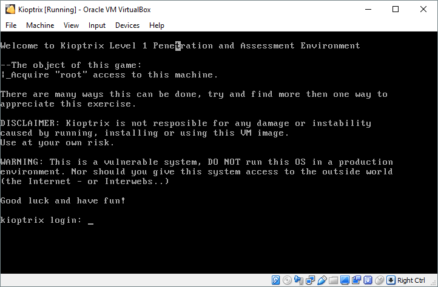
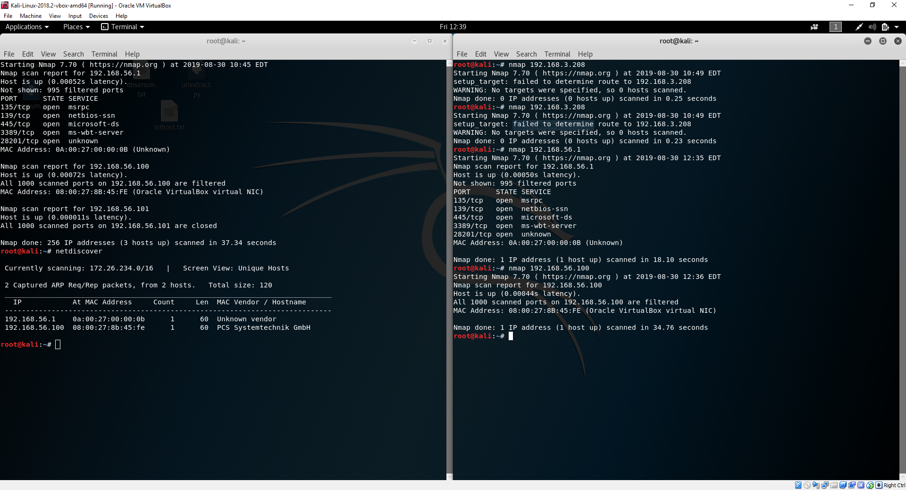

# Kioptrix 1

**SPOILERS AHEAD. YOU HAVE BEEN WARNED**

**Difficulty**: Easy
**Link**: https://www.vulnhub.com/entry/kioptrix-2014-5,62/

## Writeup

Starting off, we are greeted by the VM:



I booted up my trusty Kali Linux VM and went probing for the machine in my host-only network:



Looks like some ports are open on the machine:

* **135**: dcom-scm. [Microsoft's DCOM ](https://www.varonis.com/blog/dcom-distributed-component-object-model/)Microsoft's DCOM.
* **139**: NetBios
* **445**: Samba
* **3389**: Microsoft's Remote Desktop Protocol
* **28201**: Not exactly sure what this port is for. I found some hints [here](https://www.iana.org/assignments/service-names-port-numbers/service-names-port-numbers.xhtml?search=1&page=60) Later recon reveals that it's a Pharos port. A printing service.

Doing an nmap service scan (-sV) gives interesting results:
```
root@kali:~# nmap -sV 192.168.56.1
Starting Nmap 7.70 ( https://nmap.org ) at 2019-08-30 12:49 EDT
Nmap scan report for 192.168.56.1
Host is up (0.00056s latency).
Not shown: 995 filtered ports
PORT      STATE SERVICE       VERSION
135/tcp   open  msrpc         Microsoft Windows RPC
139/tcp   open  netbios-ssn   Microsoft Windows netbios-ssn
445/tcp   open  microsoft-ds?
3389/tcp  open  ms-wbt-server Microsoft Terminal Services
28201/tcp open  pharos        Pharos Notify (printing client)
MAC Address: 0A:00:27:00:00:0B (Unknown)
Service Info: OS: Windows; CPE: cpe:/o:microsoft:windows

```

