# Mr Robot

**SPOILERS AHEAD. YOU HAVE BEEN WARNED**

**Difficulty**: Easy
**Link**: https://www.vulnhub.com/entry/mr-robot-1,151/

## Writeup

It's a good practice to run vulnerable virtual machines in an isolated network. Away from production and/or sensitive servers and workstations.

As such, it is best to host the VMs in "Host-Only" Mode in the same subnet.

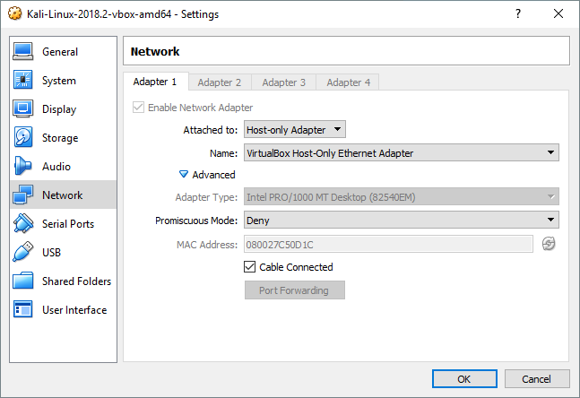

Once we launch the mr-robot VM. We are greeted with a login screen.

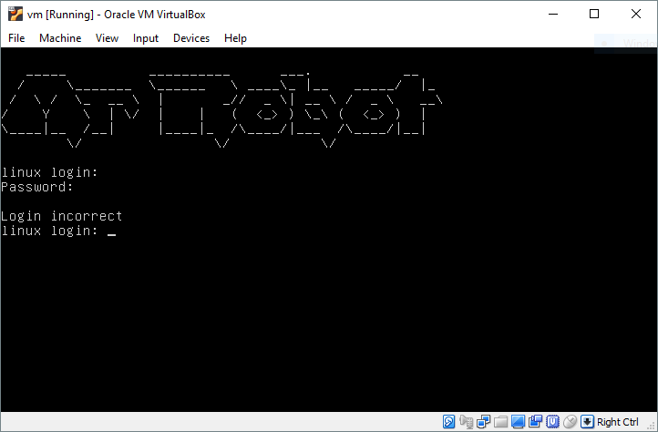

Obviously, we do not know the credentials to the box. There must be a way to enter externally (i.e. from network-facing services.)

For a quick network discovery I used *NetDiscover*, which is readily available in Kali Linux.

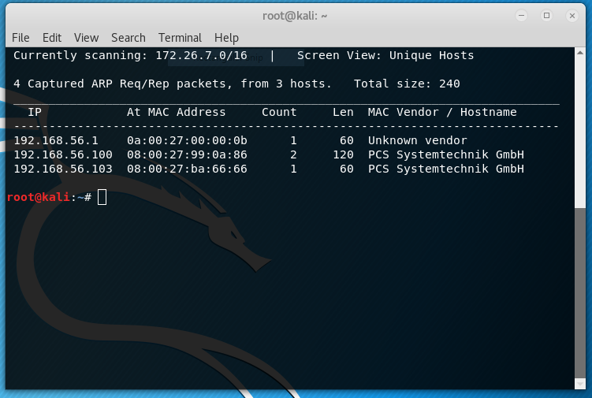

A default *nmap* scan shows this result for 192.168.56.103:

```
Nmap scan report for 192.168.56.103
Host is up (0.0013s latency).
Not shown: 997 filtered ports
PORT    STATE  SERVICE
22/tcp  closed ssh
80/tcp  open   http
443/tcp open   https
MAC Address: 08:00:27:BA:66:66 (Oracle VirtualBox virtual NIC)
```

Seems about right, Browsing to the IP via *Firefox* gives me a faux boot sequence and a menu:

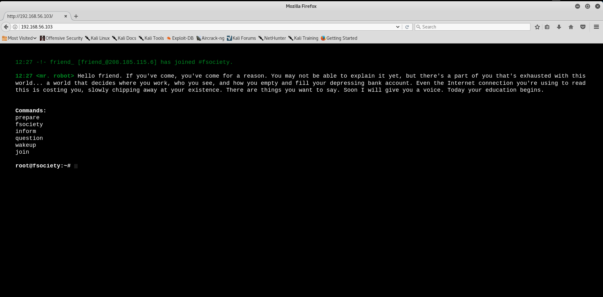


There isn't anything obviously exploitable at first glance just cool Mr Robot stuff from the show.

Viewing the page source, there is a cool ascii art but that's about it.

```
<!doctype html>
<!--
\   //~~\ |   |    /\  |~~\|~~  |\  | /~~\~~|~~    /\  |  /~~\ |\  ||~~
 \ /|    ||   |   /__\ |__/|--  | \ ||    | |     /__\ | |    || \ ||--
  |  \__/  \_/   /    \|  \|__  |  \| \__/  |    /    \|__\__/ |  \||__
-->
<html class="no-js" lang="">
  <head>
    

    <link rel="stylesheet" href="css/main-600a9791.css">

    <script src="js/vendor/vendor-48ca455c.js"></script>

    <script>var USER_IP='208.185.115.6';var BASE_URL='index.html';var RETURN_URL='index.html';var REDIRECT=false;window.log=function(){log.history=log.history||[];log.history.push(arguments);if(this.console){console.log(Array.prototype.slice.call(arguments));}};</script>

  </head>
  <body>
    <!--[if lt IE 9]>
      <p class="browserupgrade">You are using an <strong>outdated</strong> browser. Please <a href="http://browsehappy.com/">upgrade your browser</a> to improve your experience.</p>
    

    <!-- Google Plus confirmation -->
    <div id="app"></div>

    
    <script src="js/s_code.js"></script>
    <script src="js/main-acba06a5.js"></script>
</body>
</html>
```

Since we confirmed that this VM is mostly a LAMP stack, I decided to bring out one of my favorite tools. Enter *Nikto*

Luckily, we don't have to fiddle with the tool alot in this case:

```
nikto -h http://192.168.56.103/
```

which gave us plenty of results to go through.

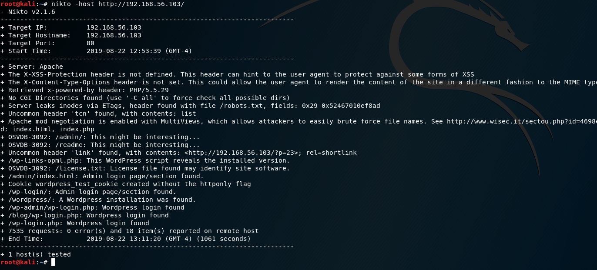

The results tell us two things:

* There is a [robots.txt](https://www.robotstxt.org/robotstxt.html) file
* There is very possibly a Wordpress instance hosted

I decide to check for both before proceeding.

Turns out there is a /robots.txt file. Hold on, there is more to it.

The content of the text file is:

```
User-agent: *
fsocity.dic
key-1-of-3.txt
```

*wget* the files and examine them. Turns out the text file does contain the key:
```
073403c8a58a1f80d943455fb30724b9
```

Neat, first key is down. But what is fsocity.dic?

using *cat* shows a **HUGE** of what appears to be a wordlist. I noticed some duplicates so I decided to clean up the wordlist:

```
uniq fsocity.dic > fsocity1.txt
```

Now we look into the possible Wordpress instance, and what do you know, there is one!

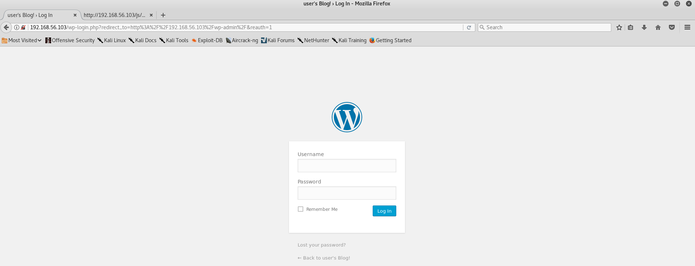

I tried couple of [default credentials](https://varyingvagrantvagrants.org/docs/en-US/default-credentials/) in hopes that it would be a misconfigured instance of Wordpress, none of them worked. However, I noticed something:

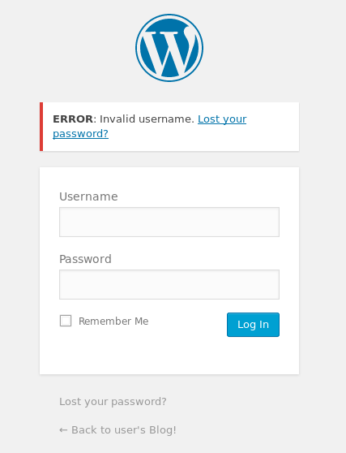

The login screen is telling us that the username is wrong. Naturally, if I give it a valid username it will tell me the password is wrong. As such, little brute forcing is in order.

In this case, I used Burp Suite <insert good tutorial here.> The Intruder module is really easy to use to conduct quick bruteforce attacks. I let the Intruder run for awhile and looked at the length of the requests send back to us.

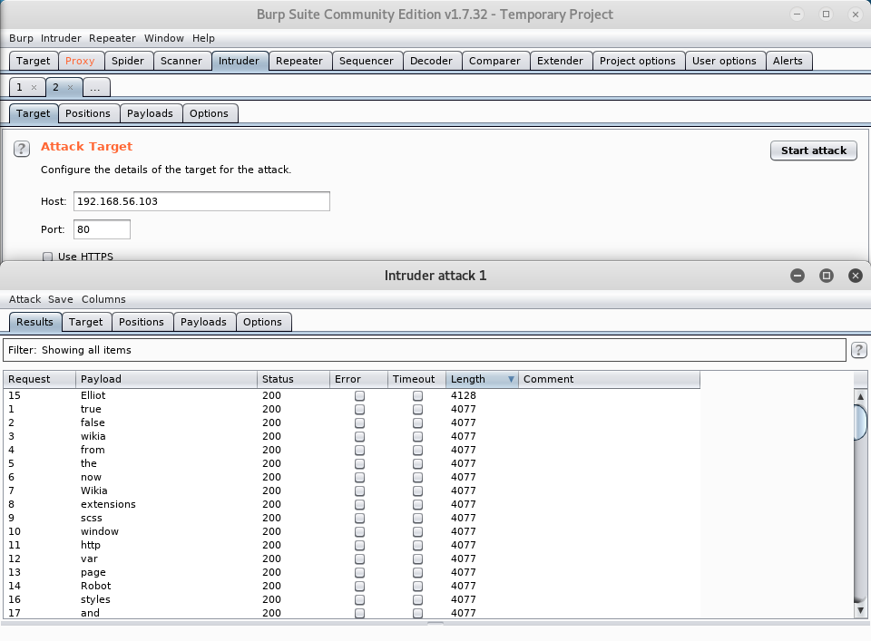

Looks like "Elliot" yielded a different request length than the other requests.

After inputting the username with gibberish password in the login page I get this:

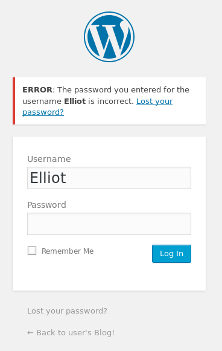

Nice! now we know that **Elliot** is a user in this Wordpress instance. Now we use Burp Suite's Intruder again to brute force the password.

Since the Community Edition of Burp Suite throttles our Intruder module to a point where it is really slow, I explored other tools to get the job done and decided to use *Zap-Proxy*

I used the fuzzer to get Elliot's password. Seeing that one value caught the highest response byte size, I decided to try that password.

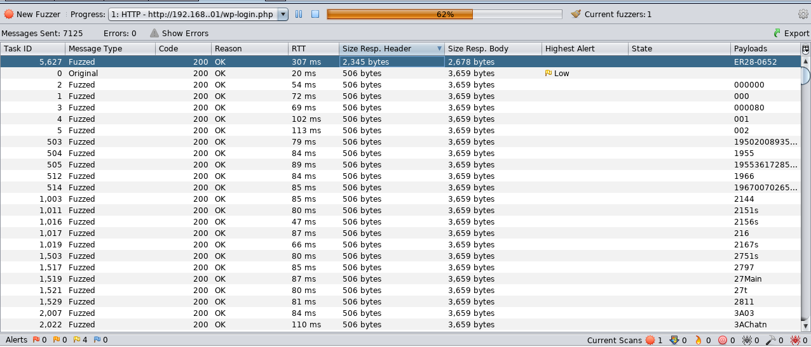

Bingo! The credentials worked!!

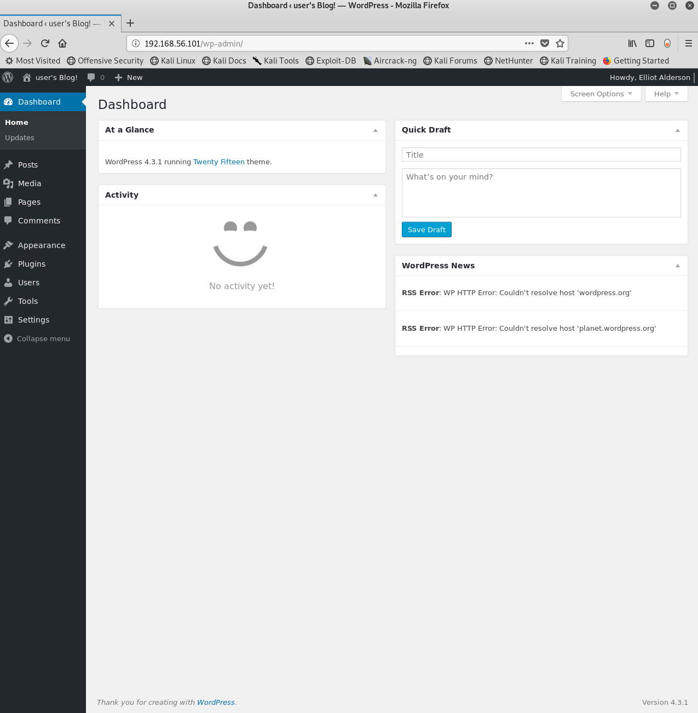

Now we need a way to get in OS-level. This can be easily done via some sort of webshell. Where do we put our webshell?

Initially, I wanted to install a plug-in to be able to edit file on the web server but turns out Wordpress has an editor by default:

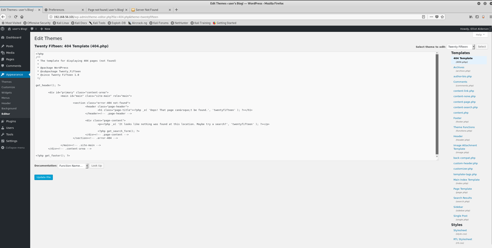

In this case, I will use *weevely*, one of my favorite webshells.

First we generate the webshell:

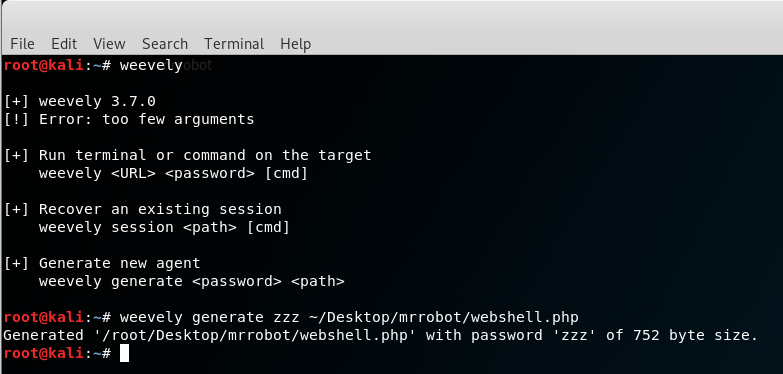

then we copy paste the content into the 404.php page template via the editor.

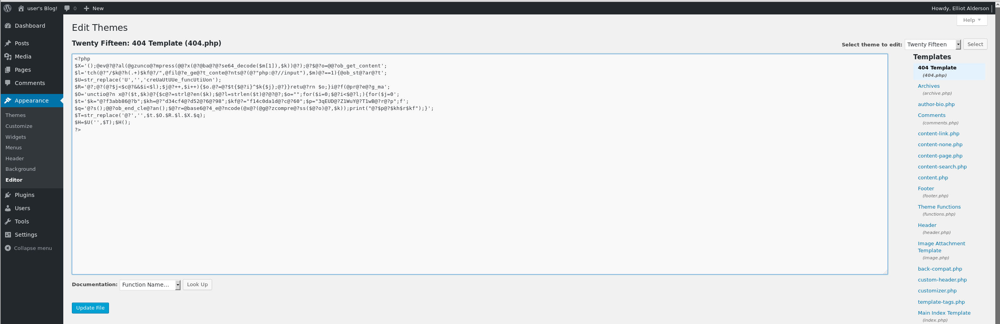

Now, looking at the Wordpress [source code](https://build.trac.wordpress.org/browser/branches#4.3/wp-content/themes/twentyfifteen) (hooray for open source software!) we see that the 404.php resides in this directory:

```
http://<host>/wp-content/themes/twentyfifteen/404.php
```

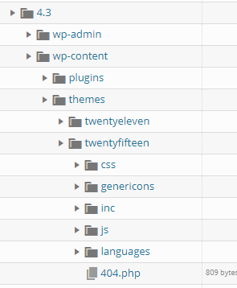


Next, we attempt the connection to the pasted webshell:
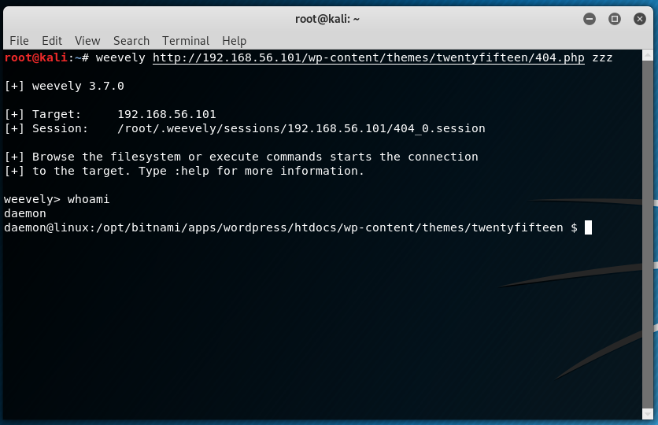

The connection was successful and it appears we are inside as **daemon**

We eventually traverse to the **home** folder and see that one user (robot) having said folder.

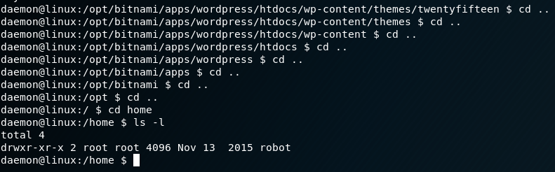

Looking inside the folder, we see some promising content:

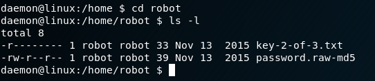

We see that permissions flag for the key is:
```
-r--------
```

Which means that the owner of the file (which is the user **robot**) is pretty much the only user that can read the file. As such, we are unable to read the file as **daemon**

We see the content of the **password.raw-md5** and find the following:
```
robot:c3fcd3d76192e4007dfb496cca67e13b
```
Which appears to be the md5 hash of the user **robot**

Providing [crackstation](https://crackstation.net/) with the hash proved useful as it turns out that the hash was cracked once before.

```
abcdefghijklmnopqrstuvwxyz
```

We try to login with the cracked password. Turns out Weevely does not support *su*, and as a result, we cannot change user to **robot**

Will need to explore other options.

I ended up using a PHP reverse shell I found packaged with Kali Linux at ```/usr/share/webshells/php```

We replace the 404.php file with the new webshell, listen to port 1234 via netcat, go the page and we connect again.

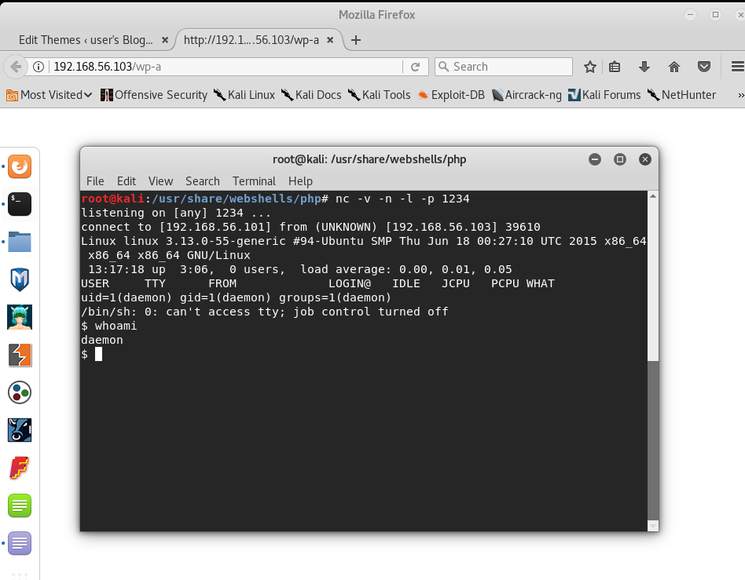

Still encountered the same issue with being unable to switch users via *su*

After doing some research, I stumbled upon [this answer](https://evertpot.com/189/), I proceeded to check if python is installed in the system.

Sure enough, both Python 2.7 and 3 are installed on the system.

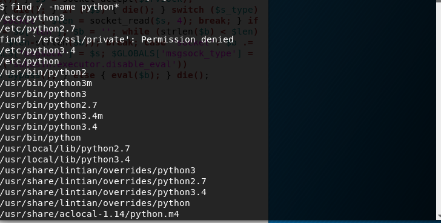

After following the answer I was able to get into a shell. Still as **Daemon**. Thankfully, *su* worked this time around. We find the key:

```
822c73956184f694993bede3eb39f959
```

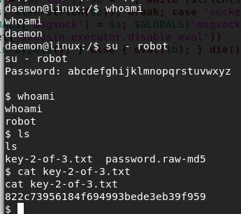

Now we need to go hunting for the third flag. 

For this portion I referred to [g0tmi1k's Linux Privilege Escalation checklist](https://blog.g0tmi1k.com/2011/08/basic-linux-privilege-escalation/)

After going through the checklist I noticed couple of things:

* There are bunch of development tools installed. i.e. Python IDLE, Perl
* Netcat is installed
* **root** is the only superuser in the system
* Was able to view /etc/passwd, but am unable to view /etc/shadow
* Found an openssh public key.
* nmap and zenmap are somehow installed and are accessible to **robot**. The nmap version is 3.81... Which is super outdated by now.

Turns out combing through ``` find / -writable -type d 2>/dev/null      # world-writeable folders ``` output was useful.

That particular version of nmap has an "interactive" mode.... which happens to give root regardless of what user you use to launch it.

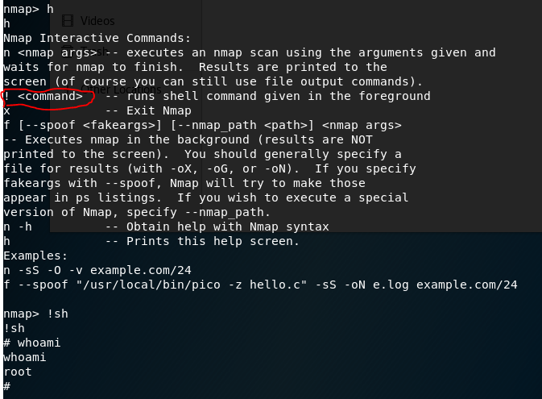

Going to the root folder, we find the 3rd key:
```
04787ddef27c3dee1ee161b21670b4e4
```

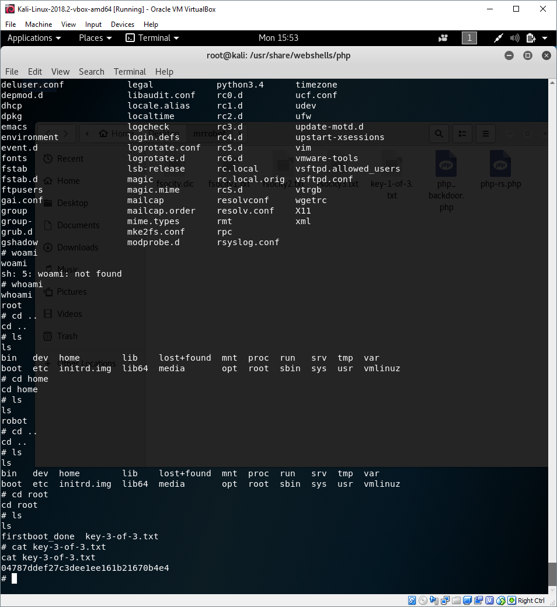

The third key concludes this boot2root.

